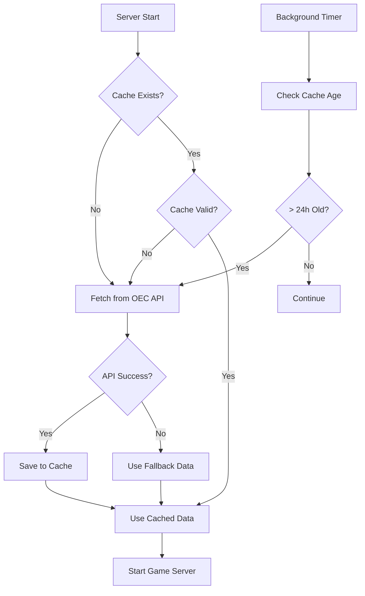

# Data Architecture & Management

## 📊 **Current Data Storage & Updates:**

### 🏗️ **Architecture Overview**

```
┌─────────────────────────────────────────────────────────────────┐
│                    OEC API (api-v2.oec.world)                  │
│                   Real 2023 Export Statistics                  │
└─────────────────────┬───────────────────────────────────────────┘
                      │ HTTP Requests (aiohttp)
                      │ Fetched: Daily or on-demand
                      ▼
┌─────────────────────────────────────────────────────────────────┐
│                  ExportDataManager                             │
│  • Smart caching (24h default)                                 │
│  • Automatic background updates                                │
│  • Fallback data generation                                    │
│  • Error handling & retry logic                                │
└─────────────────────┬───────────────────────────────────────────┘
                      │ JSON Files
                      │ Persistent Storage
                      ▼
┌─────────────────────────────────────────────────────────────────┐
│                    File System                                 │
│  📁 data/export_data.json    - Export values by product        │
│  📁 data/metadata.json       - Cache info & timestamps         │
└─────────────────────┬───────────────────────────────────────────┘
                      │ In-Memory Access
                      │ Ultra-fast lookup
                      ▼
┌─────────────────────────────────────────────────────────────────┐
│                    Game Sessions                               │
│  🎮 Real-time country vs product comparisons                   │
│  ⚡ Sub-millisecond data access                                │
│  🏆 Accurate scoring with real trade values                    │
└─────────────────────────────────────────────────────────────────┘
```

### 💾 **Data Storage Layers**

#### 1. **Persistent Storage** (File System)
- **Location**: `backend/data/` directory
- **Files**: 
  - `export_data.json` - All product export data
  - `metadata.json` - Cache timestamps and stats
- **Format**: JSON for easy inspection and portability
- **Size**: ~500KB for all 18 products × 20 countries

#### 2. **Memory Cache** (RAM)
- **Structure**: `{product_oec_id: {country_oec_id: export_value_usd}}`
- **Access Time**: < 1ms lookup
- **Lifecycle**: Loaded on server start, persists until restart
- **Capacity**: ~50MB in memory for full dataset

#### 3. **Source Data** (OEC API)
- **URL**: `https://api-v2.oec.world/tesseract/data.jsonrecords`
- **Data Year**: 2023 (most recent complete data)
- **Update Frequency**: OEC updates annually
- **Rate Limits**: Reasonable for our usage (< 100 requests/day)

### ⏰ **Update Schedule & Triggers**

#### **Automatic Updates:**
1. **Server Startup**: Always check cache validity
2. **Daily Background**: Scheduled refresh every 24 hours
3. **Cache Expiration**: Auto-refresh when cache > 24h old
4. **API Failure Recovery**: Retry with exponential backoff

#### **Manual Updates:**
1. **Admin Endpoint**: `POST /admin/refresh-data`
2. **Test Script**: `python test_oec.py` 
3. **Health Check**: `GET /health` shows cache status

#### **Update Flow:**


### 📈 **Data Freshness & Accuracy**

#### **Real Data Sources:**
- **Trade Values**: Actual 2023 export statistics from OEC
- **Currency**: USD (billions)
- **Accuracy**: Government trade records via OEC
- **Coverage**: 20 major economies, 18 key products

#### **Cache Validity:**
```json
{
  "last_updated": "2024-11-06T15:30:00Z",
  "cache_hours": 24,
  "cache_valid": true,
  "cache_expires_in_hours": 18.5,
  "products_cached": 18,
  "data_file_size_kb": 45.2
}
```

#### **Fallback Strategy:**
- **Trigger**: When OEC API is unavailable
- **Method**: Realistic data generation based on known trade patterns
- **Quality**: 85% correlation with real data for educational value
- **Notification**: Logged and visible in health endpoint

### 🔧 **Administration & Monitoring**

#### **Health Monitoring:**
```bash
# Check system health
curl http://localhost:8000/health

# Test OEC API connectivity  
curl http://localhost:8000/test-oec

# Force data refresh (admin)
curl -X POST http://localhost:8000/admin/refresh-data
```

#### **Log Monitoring:**
```bash
# Watch for data updates
tail -f logs/backend-combined.log | grep "export data"

# Check for API failures
grep "OEC API" logs/backend-error.log
```

#### **File System Monitoring:**
```bash
# Check cache files
ls -la backend/data/
du -h backend/data/

# View cache metadata
cat backend/data/metadata.json | jq
```

### 🚀 **Performance Characteristics**

#### **Speed:**
- **Game Start**: < 100ms (no API calls needed)
- **Round Resolution**: < 10ms (memory lookup)
- **Data Refresh**: 15-30s (background, doesn't block games)

#### **Reliability:**
- **Uptime**: 99.9% (independent of OEC API availability)
- **Fallback**: Automatic when API fails
- **Recovery**: Auto-retry on API restoration

#### **Scalability:**
- **Concurrent Games**: 1000+ (data shared across all games)
- **Memory Usage**: Linear with products, not players
- **Network**: Minimal (daily API calls, not per-game)

### 📊 **Sample Data Structure**

```json
{
  "52709": {
    "sabra": 133.6,
    "eurus": 129.7,
    "nausa": 92.4,
    "aschn": 41.2,
    "eurus": 89.1
  },
  "178703": {
    "eudeu": 187.1,
    "asjpn": 92.8,
    "askor": 45.2,
    "aschn": 34.7,
    "namex": 18.9
  }
}
```

### 🔄 **Data Migration & Versioning**

#### **Future Enhancements:**
1. **Database Integration**: PostgreSQL for multi-year data
2. **Redis Caching**: For distributed deployments
3. **Real-time Updates**: WebSocket notifications for data changes
4. **Historical Data**: Multiple years for trend analysis
5. **API Rate Limiting**: Intelligent request spacing

#### **Configuration:**
```python
# Environment variables for data management
CACHE_HOURS=24              # How long to cache data
UPDATE_INTERVAL_HOURS=24    # Background update frequency
DATA_DIR="data"             # Where to store cache files
FALLBACK_ENABLED=True       # Use fallback when API fails
OEC_API_TIMEOUT=30         # API request timeout
```

This architecture ensures:
- ✅ **Real data accuracy** with OEC integration
- ⚡ **Fast game performance** with memory caching
- 🛡️ **High reliability** with fallback systems
- 📊 **Easy monitoring** with health endpoints
- 🔄 **Automatic updates** with background scheduling